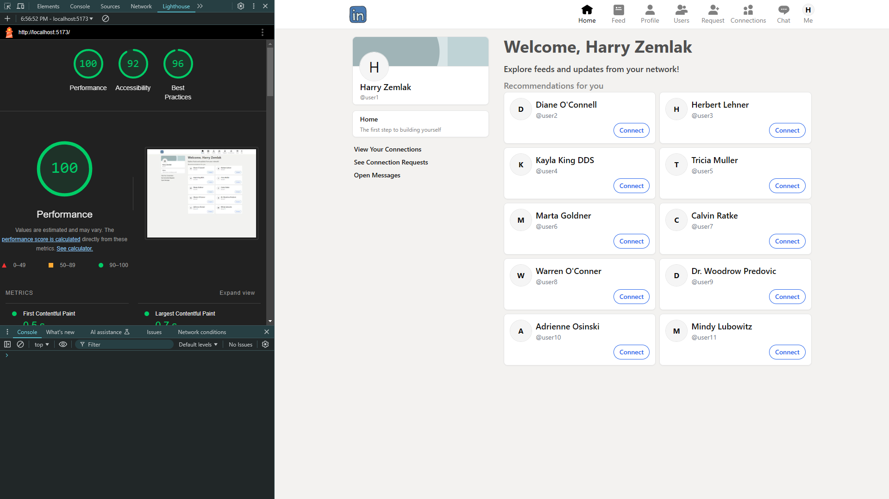

## LinkinPurry Jr

**LinkInPurry Application Description**

**LinkInPurry** is a web-based social media platform designed to facilitate secure and efficient communication and collaboration between agents in the O.W.C.A. (Organization Without a Cool Acronym). This application aims to create a safe virtual space where agents can connect professionally, share updates, and maintain secure communications within their network.

### **Core Features:**

1. **Authentication and Authorization:**
   - Secure login using JSON Web Token (JWT) for session management.
   - User registration includes fields such as name, username, email, and password.
   - Input validation for secure and accurate user data, including email format verification and password strength checks.

2. **User Profiles:**
   - Each user has a personal profile displaying their name, profile photo, work history, and skills.
   - Capability to update personal details such as profile photo, work history, and skills for customization.

3. **User Connections:**
   - Users can send, accept, or reject connection requests.
   - Comprehensive management of connection requests and connected users.
   - Mutual connections to ensure both parties consent to establish a connection.

4. **Feed:**
   - A feed feature for sharing posts or updates.
   - Users can create, read, update, and delete posts with a 280-character limit.
   - Posts are visible only to the user and their connections for enhanced privacy.

5. **Real-Time Chat and Notifications:**
   - Real-time private messaging using WebSocket for seamless communication.
   - Instant notifications for new messages or feed activity via push notifications.

6. **Performance Testing:**
   - Stress and load testing ensure the application can handle high user traffic effectively.

7. **Responsive Design:**
   - A responsive UI provides an optimal user experience across various screen sizes, from desktops to mobile devices.

8. **Docker Deployment:**
   - Docker is used to streamline the setup for both backend and frontend environments, integrating seamlessly with the PostgreSQL database.

### **Technology Stack:**

- **Backend:** REST API built with Node.js, PostgreSQL database, and Redis caching.
- **Frontend:** Single Page Application (SPA) implemented using React and WebSocket protocol for real-time updates.
- **Authentication:** JWT secured with HMAC and stored in cookies for session management.
- **Testing:** Automated stress and load tests to ensure robust application performance.


## Installation and How to Run
If you want to to run the program without using docker, you need to install the modules for backend and frontend.
```bash
cd frontend
npm install
cd ../backend
npm install
```
Then you must set the database, in this project we are using postgreSQL.
You can provide your own database or run the docker-compose.dev.yml which has set up to run the database. If you are using other than the database provided, don't forget to update the ```.env``` file.
```bash
docker compose -f docker-compose.dev.yml up
```
Initially you must have done this command in backend directory
```bash
npx prisma generate
npx prisma migrate deploy
npm run seed
```
This commands are required to init the database and add some initial data. You can skip the ```npm run seed``` if you don't need any initial data.

Run the server (backend) and client (frontend).
```bash
cd frontend
npm run build && npm run preview -- --host "0.0.0.0" --port 5173   # production mode
## OR
npm run dev                                                     # development mode
```

The other option is using the docker. You can run all program using this command
```bash
docker compose -f docker-compose.yml up --build
```
This command will wrap the database, frontend, and backend in one network.

## API Documentation
After the server is running you can access the ```http://localhost:3000/api-docs``` to look all the apis.

## Load test and Stress Test


## Lighthouse





## Work Responsibilities
| **Component**    | **Specification**                      | **NIM**                 | 
|------------------|----------------------------------------|-------------------------|
|**Features-specs**| Authentication dan Authorization       | `13522098`              | 
|                  | User profile                           | `13522098`              | 
|                  | Users' connections                     | `13522098`              | 
|                  | Feed                                   | `13522097, 13522098`    | 
|                  | Chat and websocket                     | `13522098`              | 
|                  | Notification                           | `13522098, 13522104`    | 
|                  | Stress test and load test              | `13522098, 13522097`    |
|                  | Renponsitivity                         | `13522098`              | 
|                  | Docker                                 | `13522098`              | 
|                  | API Documentation                      | `13522097`              | 
|**Pages-specs**   | Login                                  | `13522098`              | 
|                  | Register                               | `13522098`              | 
|                  | Profile                                | `13522098`              | 
|                  | Feed                                   | `13522097, 13522098`    | 
|                  | Users list                             | `13522098`              | 
|                  | Connection request                     | `13522098`              | 
|                  | Connection list                        | `13522098`              | 
|                  | Chat                                   | `13522098`              | 
|**Bonuses**       | UI/UX                                  | `13522098`              | 
|                  | Typing                                 | `13522098`              | 
|                  | Lighthouse                             | `13522098`              | 

## Completed Bonuses
- UI/UX like LinkedIn
- Typing indicator
- Good score of lighthouse